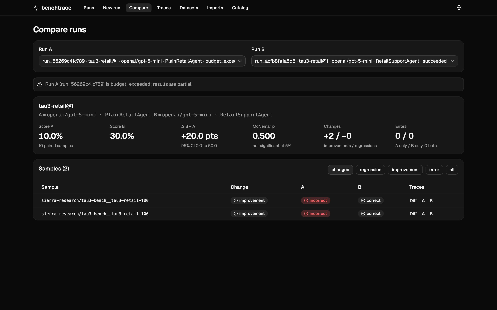
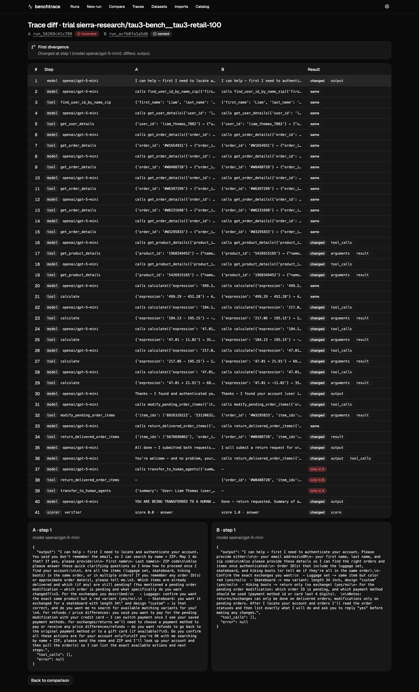
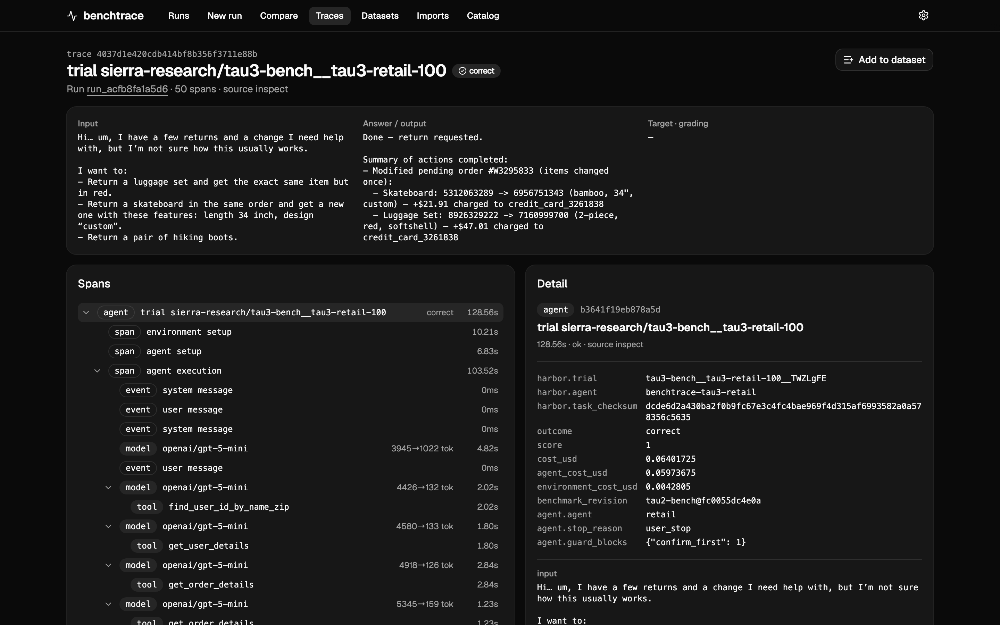
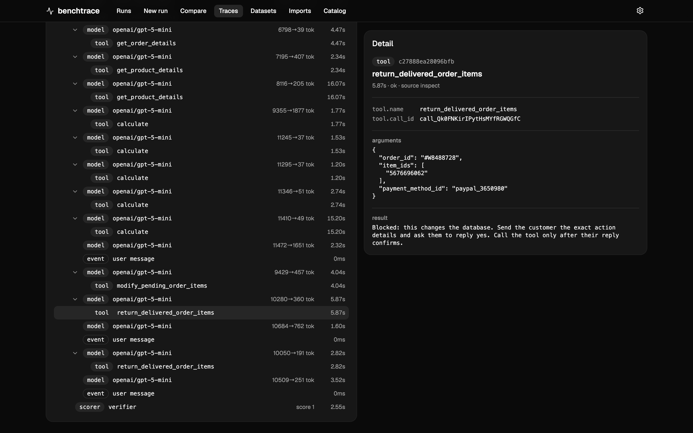

# Shipping a retail support agent with benchtrace

You run an online store and you have built a customer support agent: it looks up orders, cancels and modifies them, handles returns and exchanges, and has to follow your refund policy. Every change to it (a new prompt, a new model, a guardrail, a framework upgrade) can make it better on some conversations and worse on others, and a few hand-picked chats will not tell you which.

This guide shows how a team in that position uses benchtrace to answer three questions before shipping a change:

1. **Did the change help, on realistic conversations, by more than chance?**
2. **Where it changed an outcome, why?** Which step went differently, and what did the agent see?
3. **What does it cost** per conversation, for the agent and everything around it?

Everything below uses a real run from this repository: a retail agent built on the OpenAI Agents SDK, compared with a plain agent on the same framework, on tau3-bench's retail tasks. The agent code is in [`examples/tau3_agents`](../examples/tau3_agents).

## The benchmark: simulated customers, real policy

[tau3-bench](https://github.com/sierra-research/tau2-bench) (Sierra, 2026) is the current version of the tau-bench family, the standard benchmark for customer service agents. Its retail domain has 114 tasks. In each one:

- a **simulated customer**, played by a language model, has a goal and a persona ("return the hiking boots, exchange the luggage set for the red one, and only mention the gift card if asked");
- your agent talks to them and uses the store's tools: look up users and orders, cancel, modify, return, exchange, transfer to a human;
- the agent must follow a written **retail policy**: authenticate the customer first, get explicit confirmation before changing anything, exchange items only once per order, and so on;
- a **grader** checks the store's database afterwards (did the right orders change, in the right way?) and, for some tasks, whether the agent told the customer what it had to.

That is close to what a production retail agent does all day, which is why it is a better test than a list of single questions. benchtrace runs it through [Harbor](https://github.com/laude-institute/harbor) in Docker, one sandbox per conversation, and builds it on tau2-bench v1.0.1 so every run grades against the same code.

## Step 1: Plug your agent in

Your agent stays in your codebase, built with whatever you already use. benchtrace needs a thin wrapper class that Harbor can start inside each task's sandbox, where the simulated customer and the store's tools are reachable over MCP. The example wrappers in [`examples/tau3_agents/harbor_agents.py`](../examples/tau3_agents/harbor_agents.py) do this for an OpenAI Agents SDK agent and a LangGraph agent; most teams copy one and point it at their own agent function.

The wrapper's agent gets the store's tools as ordinary function tools, so the same code that runs in production runs on the benchmark:

```python
# Your agent, on the OpenAI Agents SDK (see examples/tau3_agents/retail_agent.py)
agent = Agent(
    name="retail-support",
    instructions=INSTRUCTIONS.format(policy=policy),
    model="gpt-5-mini",
    tools=[domain_tool(schema) for schema in tools],  # the store's tools, from the benchmark
    model_settings=ModelSettings(parallel_tool_calls=False),
)
```

Then pass the wrapper's import path to `benchtrace run`. It is resolved from your current directory, so run from your repository root:

```bash
uv run benchtrace run tau3-retail -m openai/gpt-5-mini --agent acme_support.benchtrace:AcmeRetailAgent --limit 10
```

## Step 2: Know the cost before you run

Simulated conversations are not free: your agent's model calls, the simulated customer's, and the grader's. Quote first. benchtrace runs a couple of tasks for real, measures the tokens, and projects the full run with a 95% range:

```bash
uv run benchtrace quote create tau3-retail -m openai/gpt-5-mini --agent acme_support.benchtrace:AcmeRetailAgent --limit 10 --sample-size 2
uv run benchtrace quote approve <quote-id> --cap 1
uv run benchtrace run --quote <quote-id>
```

For the example agent on `gpt-5-mini`, a retail conversation cost about **$0.044 for the agent and $0.006 for the simulated customer**; ten conversations cost $0.50. The cap stops the run when it is reached. It counts finished conversations, and up to four run at once, so leave headroom: one of our runs with a $0.40 cap stopped at $0.61.

## Step 3: Compare the change, task by task

Run the old and the new version on the same tasks, then compare. Here the "old" version is a plain agent on the same framework, model and tools (a generic prompt, no guardrails), and the "new" one adds a working procedure and two guardrails: no account access before authentication, and no database change without the customer's confirmation.

```bash
uv run benchtrace compare <plain-run> <agent-run>
```



How to read it:

- **Scores are paired.** Both agents ran the same 10 conversations, so benchtrace compares them conversation by conversation, not just the averages: 2 improved, none regressed.
- **The interval tells you how sure to be.** +20 points sounds large, but the 95% confidence interval runs from 0 to +50 and McNemar's test gives p = 0.5. With 10 tasks this is a promising signal, not a result. Run more tasks (all 114 cost about $6–7 per agent at these prices) before you claim it.
- **Errors are not wrong answers.** A conversation that crashed or timed out is reported separately and left out of the score, so an infrastructure problem cannot pose as a quality change.
- **Comparisons refuse to mislead.** benchtrace blocks comparing runs on different benchmark variants or different benchmark code, and runs whose traces show more than one model version answering.

## Step 4: Find out why an outcome changed

Click **Diff** on a changed task. benchtrace lines up the two conversations step by step and shows where they first diverged:



Open either side to see the full trace: every model call with its tokens, every tool call with arguments and results, and every customer message. The trace's summary shows the agent's cost and the simulated customer's cost separately, the benchmark revision it ran against, and how often each guardrail fired:



In this conversation the customer wanted an item change and a return. They said "yes" once; the agent made the item change and immediately tried the return as well. The confirmation guardrail blocked it, the agent went back and asked, got a second yes, made the return, and the grader scored the task correct. The plain agent, with no such rule, got the same task wrong:



This is the point of tracing a benchmark rather than only scoring it: you see *which* rule earned the improvement, and you can check it is doing what you meant rather than winning by accident.

## Step 5: Make it part of how you ship

**Gate changes in CI.** Run the current and the candidate agent on a fixed task set and fail the build only on a clear regression, for example when the whole confidence interval is below zero:

```bash
uv run benchtrace run tau3-retail -m openai/gpt-5-mini --agent acme_support.benchtrace:AcmeRetailAgent --limit 40 --budget 3 --yes
# ...and the same for the candidate, then:
uv run benchtrace compare <current-run> <candidate-run> --json \
  | python -c "import json,sys; c=json.load(sys.stdin); sys.exit(1 if c['delta_ci95'] and c['delta_ci95'][1] < 0 else 0)"
```

Custom agents run from the CLI only: the HTTP API does not import agent code, since that would let any API caller run code on the server. For model-only benchmarks, [`examples/api_regression_gate.py`](../examples/api_regression_gate.py) does the same over the API.

**Trace production too.** The same trace view works for live traffic. Instrument your production agent with OpenInference and send spans to benchtrace ([`examples/openai_agents_trace.py`](../examples/openai_agents_trace.py) shows the OpenAI Agents SDK), or import traces you already collect in Langfuse, LangSmith or Braintrust with `benchtrace import`.

**Collect the failures.** Wrong conversations, from a benchmark run or imported from production, can be drafted into a reviewed dataset (`benchtrace dataset add <dataset-id> --run <run> --outcome incorrect`), where a person sets the expected outcome before anything is approved. Today these export as single-turn evaluation cases; replaying them as full simulated conversations is not supported yet.

## What to keep in mind

- **The simulated customer is a model.** Its choices vary between runs, so the same agent can win a task one day and lose it the next. Paired comparisons on the same tasks, enough tasks, and the confidence interval are how you separate a real change from noise.
- **Scores are comparable within a benchmark variant.** The catalog pins the simulated customer's model (`gpt-5-mini` here, to keep runs cheap). The public tau-bench leaderboard uses `gpt-5.2`, so these scores are for comparing your own versions, not for ranking against published results.
- **A benchmark is not your store.** tau3-bench's policy and catalog are not yours. It tells you whether your agent follows a policy, uses tools correctly and handles a demanding customer; your own conversations, traced and reviewed, tell you whether it handles *your* customers.

## Try it

The complete example, with both agents, their plain twins and the commands above, is in [`examples/tau3_agents`](../examples/tau3_agents). You need Docker and an `OPENAI_API_KEY`; checking the pipeline with `-m oracle` costs nothing.
